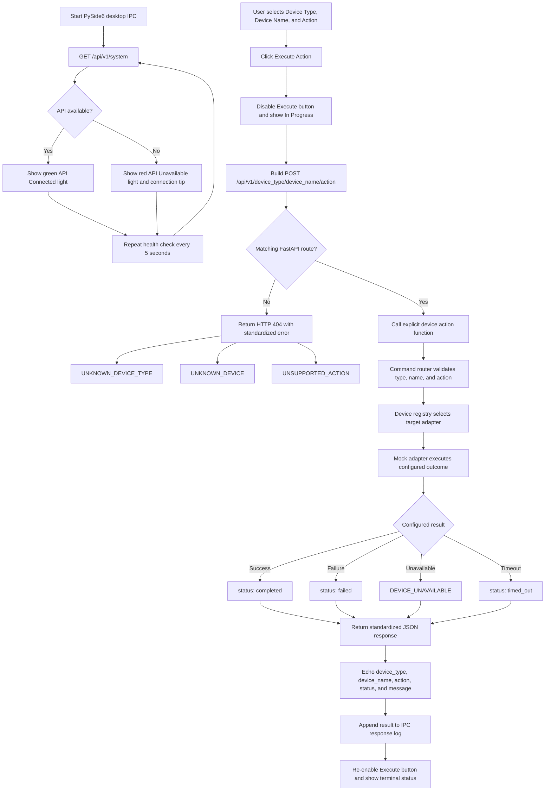

# IPC and REST API Workflow



## Supported action paths

```text
POST /api/v1/flex/{device_name}/dispense
POST /api/v1/flex/{device_name}/drop_tip
POST /api/v1/arm/{device_name}/grab_sample
POST /api/v1/arm/{device_name}/drop_sample
POST /api/v1/plc/{device_name}/open_door
POST /api/v1/plc/{device_name}/close_door
```

## Component responsibilities

| Component | Responsibility |
| --- | --- |
| PySide6 IPC | Collects selections, checks API availability, submits actions, and displays results. |
| FastAPI endpoint | Matches the explicit action route and returns HTTP validation errors. |
| Command router | Validates the type/name/action combination and requests the correct adapter. |
| Device registry | Maps Flex 1, Flex 2, PLC, Static Arm, and Tracked Arm to adapter instances. |
| Mock adapter | Simulates success, failure, unavailable, or timeout behavior without hardware. |
| Response model | Returns the device type, device name, action, status, message, request ID, and completion time. |

## Current boundary

The **Run Demo** button is visible but disabled. It does not call the API until
the ordered demo sequence and orchestration rules are defined.
